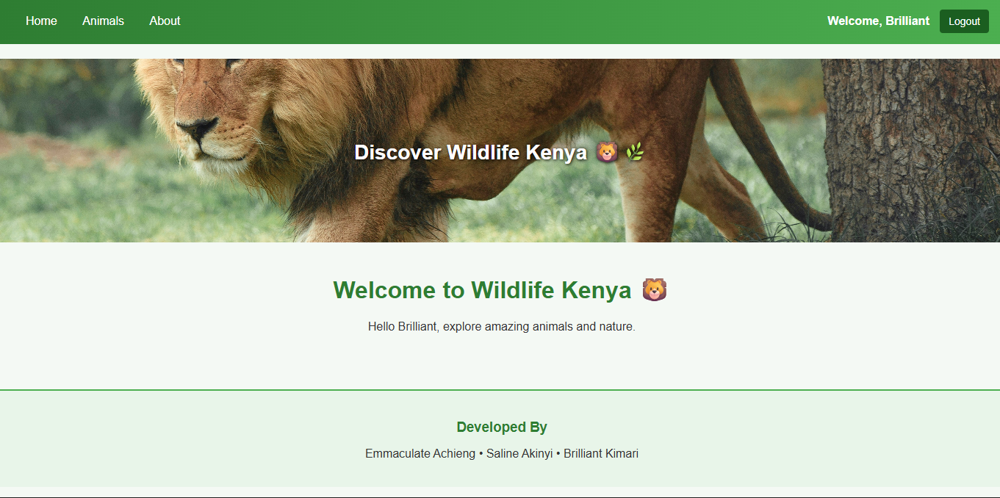

# Wildlife Kenya 🦁

A beautiful Django web application for exploring Kenya's incredible wildlife and learning about wildlife conservation.

## About

Wildlife Kenya is an educational platform dedicated to fostering appreciation for Kenya's unique biodiversity. The website provides information about iconic African animals and promotes conservation awareness.

## Features

- **User Authentication** - Register and login with email and password
- **Home Page** - Welcome page with beautiful hero section
- **Animals Gallery** - Interactive grid showcasing Kenya's wildlife with descriptions
- **About Section** - Learn about our mission and wildlife conservation
- **Secure Login System** - Email-based authentication with password validation
- **Responsive Design** - Beautiful wildlife-themed green color scheme
- **User Profiles** - Personalized welcome messages for logged-in users

## Usage

### Creating an Account
- Click "Login/Register" in the navigation
- Switch to the "Register" tab
- Enter your name, email, and password
- Click "Register"

### Logging In
- Click "Login/Register"
- Enter your registered email and password
- Click "Login"

### Exploring the Site
- **Home** - View the welcome message
- **Animals** - Browse Kenya's iconic wildlife with descriptions
- **About** - Learn about wildlife conservation

## Pages

- `/` - Home page
- `/auth/` - Login/Registration page
- `/animals/` - Wildlife gallery
- `/about/` - About Wildlife Kenya
- `/logout/` - Logout (for authenticated users)

## Developers

👥 **Development Team:**
- **Emmaculate Achieng**
- **Saline Akinyi**
- **Brilliant Kimari** 
---

**Made with ❤️ for Wildlife Conservation**
